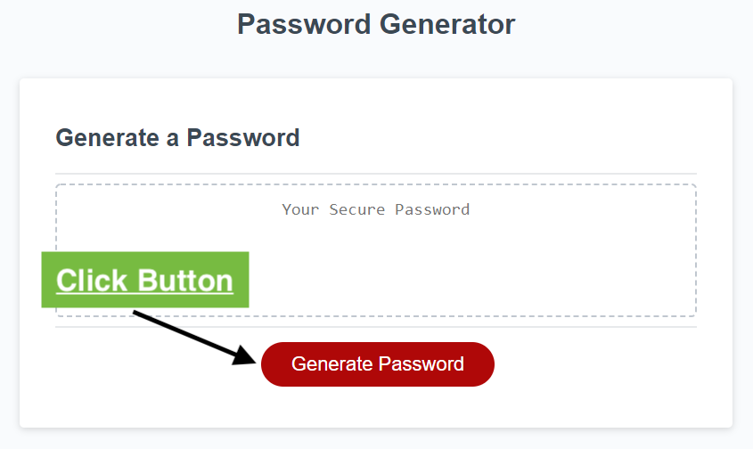
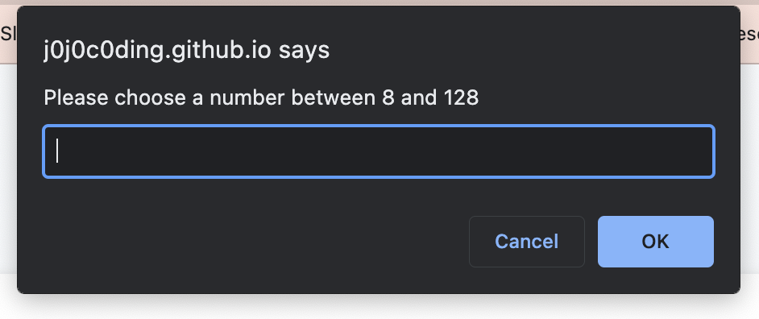
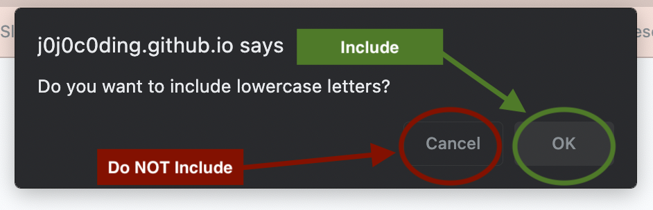
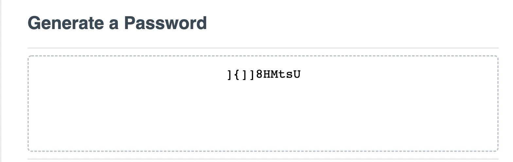

# Password Generator 

## Description  
This web application will generate a password based on user input using JavaScript. The generated password will be between 8 and 128 characters long and contain character groups selected by user. Each password generated will contain at least 1 character from each selected character groups. 

## Screenshot

## Usage  
### 1. Click Generate Password button
  
### 2. Type desired password length (At least 8 and less than 128), click 'OK' or hit enter  

### 3. Answer prompts to choose characters to add (Cancel = Do NOT Include | OK = Include)

### 4. Repeat step 3 until prompts are finished
### 5. New password will appear in the box!

## Credits 
### Generating random characters loop:
- [**Programiz: Learn to Code for Free**](https://www.programiz.com/javascript/examples/generate-random-strings)  

### Creating Tests for Password Validation:
- [**CodeGrepper: The Query & Answer System for the Ambitious Develope**](https://www.codegrepper.com/code-examples/javascript/javascript+check+if+string+contains+at+least+one+special+characters)

- [**MelvinGeorge.me**](https://melvingeorge.me/blog/check-if-string-contains-atleast-one-letter-regex-javascript)